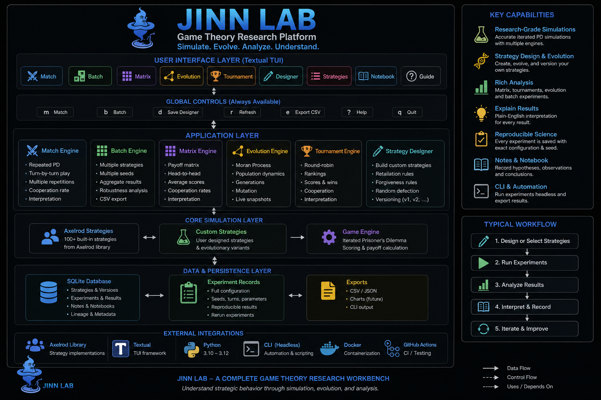

# JinnLab 3



JinnLab is a keyboard-first Textual research workbench for repeated Prisoner's Dilemma and evolutionary game theory.

## Portfolio-grade capabilities

- Head-to-head Axelrod matches with cooperation metrics and seeded reproducibility.
- Batch experiment builder across multiple strategies and seeds.
- Pairwise strategy payoff matrix.
- Finite-population evolutionary simulation with mutation and generation snapshots.
- Round-robin tournament rankings.
- Rule-based Strategy Designer with persistent version lineage (`v1 → v2 → v3`).
- Persistent strategy notes and experiment notebook (hypothesis, observation, conclusion).
- Reproducible experiment IDs and match reruns.
- SQLite/WAL persistence, CSV export, analytics, and a headless JSON/CSV CLI.
- In-app instructions and plain-English result interpretation on every analysis workflow.

## TUI

Run:

```bash
jinnlab
```

Keyboard shortcuts: `m` starts a match, `1`–`9` navigate major labs, `r` refreshes, `e` exports, and `q` quits.

The **Guide** tab explains score, cooperation rate, tournament rank, population share, seeds, repetitions, and how to avoid over-interpreting a single run.

## Headless CLI

```bash
jinnlab match "Tit For Tat" Defector --turns 200 --repetitions 10 --seed 42
jinnlab tournament "Tit For Tat" Defector Grudger Cooperator --output csv
jinnlab matrix "Tit For Tat" Defector Grudger
jinnlab evolve "Tit For Tat=40" "Defector=30" "Cooperator=30" --generations 100
```

## Install

```bash
bash install.sh
jinnlab
```

Data lives at `~/.local/share/jinnlab/jinnlab.db`; exports live under `~/.local/share/jinnlab/exports/`.

## Development

```bash
python3 -m venv .venv
source .venv/bin/activate
pip install -e '.[dev]'
pytest
```

## CI and container

GitHub Actions tests Python 3.10–3.12 on pushes and pull requests.

Headless experiments can run in a container:

```bash
docker build -t jinnlab .
docker run --rm jinnlab match "Tit For Tat" Defector --seed 42
```

The TUI is intended for a real terminal; the container entry point defaults to the headless CLI.

## Keyboard shortcuts

- `m` — start the current Match experiment
- `b` — run the Batch experiment
- `d` — save the current Strategy Designer version
- `1`–`9` — switch major workbench tabs
- `e` — export experiments to CSV
- `q` — quit

The Match, Batch, and Designer screens are vertically scrollable so their primary action buttons remain reachable on smaller terminals.

## 3.2 Designer live refresh
Custom strategy families are available immediately after saving. Use `FamilyName` for the latest version or `FamilyName vN` for an exact saved version.

## Install from PyPI

JinnLab is available on PyPI:

```bash
python3 -m pip install jinnlab
jinnlab
```

Upgrade to the latest release with:

```bash
python3 -m pip install --upgrade jinnlab
```

Package page:

https://pypi.org/project/jinnlab/

